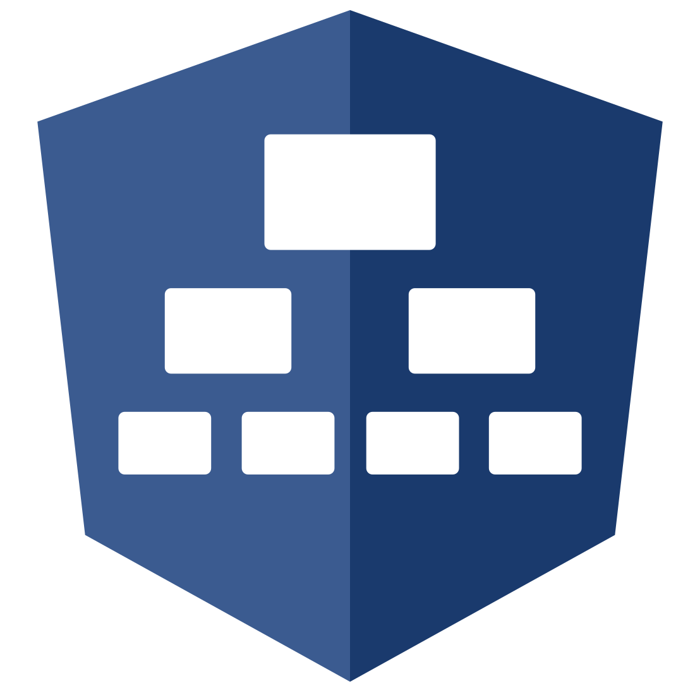

<div align="center">

#  NgDrawFlow

[](https://npmjs.com/package/@ng-draw-flow/core)
[](https://app.codecov.io/gh/taiga-family/ng-draw-flow/tree/main/projects)
[](https://github.com/taiga-family/ng-draw-flow/actions/workflows/build.yml)
[](https://github.com/taiga-family/ng-draw-flow/actions/workflows/deploy.yml)
[](https://docs.renovatebot.com/)
[](https://github.com/prettier/prettier)
[](https://opensource.org/licenses/Apache-2.0)

</div>

NgDrawFlow is a library for creating interfaces based on displaying data as nodes. A node is a div container into which
you can place any Angular component. The library takes care of all the state management of the node on the canvas.
Thanks to this, it allows you to create both simple diagrams and complex editors for building customised charts and
graphs.

## Documentation

[taiga-family.github.io/ng-draw-flow](https://taiga-family.github.io/ng-draw-flow)

## Installation

To get started locally you should have a few things:

- [Node.js](https://nodejs.org/) installed.
- A working knowledge of [Angular](https://angular.dev/). You don't need to be an expert, but you should be comfortable
  with the basics.

First, spin up a new Angular project

```bash
ng new my-app
```

NgDrawFlow is published on npm as ng-draw-flow, so go ahead and add it next.

```bash
npm i @ng-draw-flow/core --save
```

Lastly, spin up the dev server and we're good to go!

```bash
ng serve
```

## Import Dependencies and Register Node Components

To get started with the ng-draw-flow library, begin by setting up your module with the necessary imports and component
registrations.

Add the `NgDrawFlowComponent` and `ReactiveFormsModule` to your module's imports array:

```ts
imports: [
  // ... (other necessary imports)
  NgDrawFlowComponent,
  ReactiveFormsModule,
];
```

Then, within the providers section, register the components that you want to be available for use as nodes within the
graph editor and optionally configure connection arrowheads:

`app.module.ts`

```ts
providers: [
  provideNgDrawFlowConfigs({
    nodes: {
      yourNode: YourNodeComponent,
    },
    connection: {
      arrowhead: {type: DfArrowhead.Arrow},
    },
  }),
];
```

The `connection.arrowhead` option accepts a `DfArrowhead` value (`Arrow`, `ArrowClosed`, or `None`) and optional `width`
and `height` settings.

## Set Up Data Model and Control for Graph Structure

In the component where you intend to construct your graph, you need to create a data structure that defines the nodes
and connections.

`app.component.ts`

```ts
data: DfDataModel = {
  nodes: [],
  connections: [],
};
form = new FormControl(this.data);
```

Next, link this data structure to your ng-draw-flow component using a FormControl. This will allow for reactive updates
and interactions within your graph editor:

`app.component.html`

```html
<ng-draw-flow [formControl]="form"></ng-draw-flow>
```

This setup ensures that your ng-draw-flow component is fully integrated with the Angular forms system, enabling seamless
data flow and state management for your graph.

## Populate Example DfDataModel

To illustrate how to set up the `DfDataModel` with actual data, the following example lays out a scenario with a
collection of nodes and their connections:

`app.component.ts`

```ts
data: DfDataModel = {
  nodes: [
    {
      id: 'node-1',
      data: {type: 'yourNode', text: 'This base node'},
      position: {x: 0, y: 0},
      startNode: true,
    },
    {id: 'node-2', data: {type: 'yourNode', text: 'This child node 1'}, position: {x: 250, y: 50}},
    {id: 'node-3', data: {type: 'yourNode', text: 'This child node 2'}, position: {x: 250, y: -50}},
    {
      id: 'node-4',
      data: {type: 'yourNode', text: 'This child node 3'},
      position: {x: 500, y: 0},
      endNode: true,
    },
  ],
  connections: [
    {
      source: {nodeId: 'node-1', connectorType: DfConnectionPoint.Output, connectorId: 'node-1-output-1'},
      target: {nodeId: 'node-2', connectorType: DfConnectionPoint.Input, connectorId: 'node-2-input-1'},
    },
    {
      source: {nodeId: 'node-1', connectorType: DfConnectionPoint.Output, connectorId: 'node-1-output-1'},
      target: {nodeId: 'node-3', connectorType: DfConnectionPoint.Input, connectorId: 'node-3-input-1'},
    },
    {
      source: {nodeId: 'node-2', connectorType: DfConnectionPoint.Output, connectorId: 'node-2-output-1'},
      target: {nodeId: 'node-4', connectorType: DfConnectionPoint.Input, connectorId: 'node-4-input-1'},
    },
    {
      source: {nodeId: 'node-3', connectorType: DfConnectionPoint.Output, connectorId: 'node-3-output-1'},
      target: {nodeId: 'node-4', connectorType: DfConnectionPoint.Input, connectorId: 'node-4-input-1'},
    },
  ],
};
```

Each `node` mainly consists of an `id`, a `position`, and a `data` field. Inside the `data` field, you need to specify
the node type that was previously registered and all the data you want to provide to the node.

The `connections` array contains objects that describe the start and end points of each connection. The `source` and
`target` holds information about which node and specific connector are used for each connection.

## Creating Custom Nodes

In ng-draw-flow, nodes can be customized to look and function just how you want them to. To create your own node, you
should develop a component that extends from the NgDrawFlowBaseNode class. This component will incorporate directives
such as `DrawFlowInputDirective` and `DrawFlowOutputDirective`.

```ts
import {NgIf} from '@angular/common';
import {ChangeDetectionStrategy, Component} from '@angular/core';
import {DfInputComponent, DfOutputComponent, DrawFlowBaseNode} from '@ng-draw-flow/core';

@Component({
  standalone: true,
  selector: 'app-your-node',
  imports: [NgIf, DfInputComponent, DfOutputComponent],
  templateUrl: './your-connectors.component.html',
  styleUrls: ['./your-connectors.component.less'],
  changeDetection: ChangeDetectionStrategy.OnPush,
})
export class YourNodeComponent extends DrawFlowBaseNode {}
```

```less
:host {
  background: var(--tui-base-09);
  width: 10rem;
  box-shadow: var(--tui-shadow);
  border-radius: 0.5rem;
  padding: 0.5rem;
  border: 0.0625rem solid transparent;
  transition: border-color 0.2s ease-in-out;
  color: var(--tui-base-01);

  &.df-selected {
    border-color: var(--tui-text-action);
  }
}

.input,
.output {
  position: absolute;
  z-index: 1;
}

.input {
  left: -0.5rem;
  top: 0.25rem;
}

.output-wrapper {
  position: relative;
}

.output {
  right: -0.5rem;
  top: 0;
}
```

```html
<df-input
  class="input"
  *ngIf="!startNode"
  [connectorData]="{nodeId, connectorId: nodeId + '-input-1', single: false}"
/>

<p class="tui-text_body-xs">{{ model.text }}</p>

<df-output
  class="output"
  *ngIf="!endNode"
  [connectorData]="{nodeId, connectorId: nodeId + '-output-1', single: false}"
/>
```
