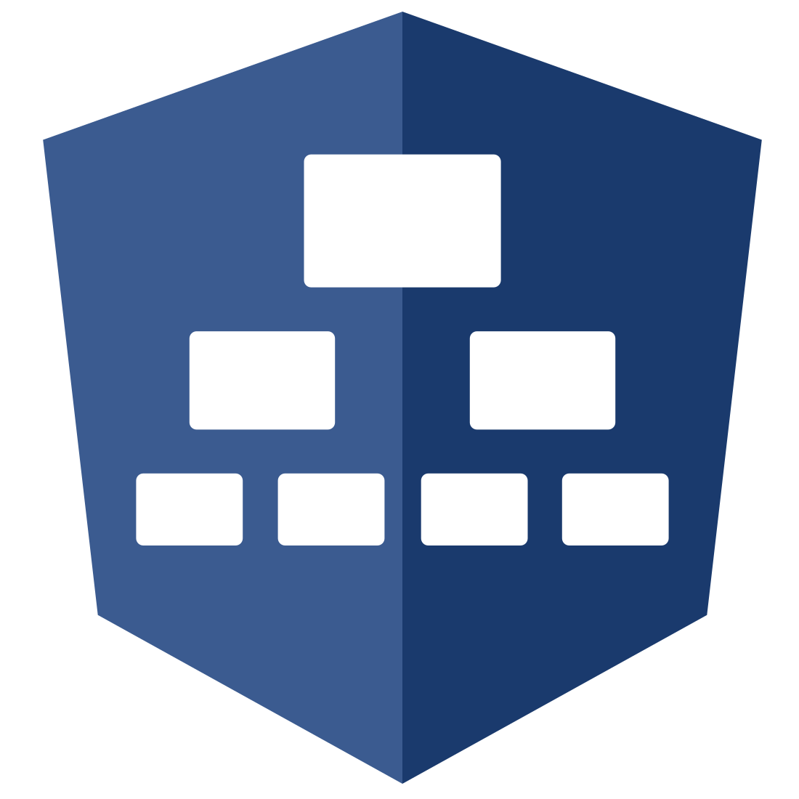

<div align="center">

#  NgDrawFlow

[](https://npmjs.com/package/@ng-draw-flow/core)
[](https://app.codecov.io/gh/taiga-family/ng-draw-flow/tree/main/projects)
[](https://github.com/taiga-family/ng-draw-flow/actions/workflows/build.yml)
[](https://github.com/taiga-family/ng-draw-flow/actions/workflows/deploy.yml)
[](https://opensource.org/licenses/Apache-2.0)

</div>

NgDrawFlow is an Angular library for building node-based editors, workflow builders and interactive diagrams. Custom
Angular components render the nodes, while the library provides the canvas, connections, selection, drag and drop, pan
and zoom, validation, and reactive state synchronization.

The main package is `@ng-draw-flow/core`. Node positions belong to the graph model, so core works for both manually
arranged diagrams and applications that calculate positions themselves.

## Packages

| Package                                                                    | Purpose                                                                                 |
| -------------------------------------------------------------------------- | --------------------------------------------------------------------------------------- |
| [`@ng-draw-flow/core`](https://npmjs.com/package/@ng-draw-flow/core)       | Canvas, custom nodes, connectors, connections, interactions, validation and state APIs. |
| [`@ng-draw-flow/layouts`](https://npmjs.com/package/@ng-draw-flow/layouts) | Optional automatic strict-tree positioning for core graphs.                             |

## Documentation

- [Documentation](https://taiga-family.github.io/ng-draw-flow)
- [Quick start](https://taiga-family.github.io/ng-draw-flow/documentation/quickstart)
- [Connectors](https://taiga-family.github.io/ng-draw-flow/documentation/connectors)
- [Dynamic layouts](https://taiga-family.github.io/ng-draw-flow/documentation/layouts)
- [Examples](https://taiga-family.github.io/ng-draw-flow/examples/overview)
- [Migration guides](https://taiga-family.github.io/ng-draw-flow/documentation/migrations)

## Requirements

- Angular 19 or later
- Taiga UI Polymorpheus 5
- Angular forms: Reactive Forms on Angular 19+, or the Signal Forms CVA interoperability path on a compatible Angular
  release

## Installation

```bash
npm install @ng-draw-flow/core
```

## Quick Start

Create a standalone component for a node. The node decides where its connectors are rendered and what application data
is displayed.

```ts
import {ChangeDetectionStrategy, Component} from '@angular/core';
import {DfInputComponent, DfOutputComponent, DrawFlowBaseNode} from '@ng-draw-flow/core';

@Component({
  standalone: true,
  selector: 'app-basic-node',
  imports: [DfInputComponent, DfOutputComponent],
  template: `
    @if (!startNodeSignal()) {
      <df-input
        class="input"
        [connectorData]="{
          nodeId: nodeIdSignal(),
          connectorId: nodeIdSignal() + '-input-1',
          single: false,
        }"
      />
    }

    <strong>{{ modelSignal().label }}</strong>

    @if (!endNodeSignal()) {
      <df-output
        class="output"
        [connectorData]="{
          nodeId: nodeIdSignal(),
          connectorId: nodeIdSignal() + '-output-1',
          single: false,
        }"
      />
    }
  `,
  styles: `
    :host {
      position: relative;
      display: block;
      min-inline-size: 10rem;
    }

    .input,
    .output {
      position: absolute;
      inset-block-start: 50%;
      transform: translateY(-50%);
    }

    .input {
      inset-inline-start: -1rem;
    }

    .output {
      inset-inline-end: -1rem;
    }
  `,
  changeDetection: ChangeDetectionStrategy.OnPush,
})
export class BasicNodeComponent extends DrawFlowBaseNode {}
```

Register the node component, create a `DfDataModel`, and bind it through a non-nullable `FormControl`.

```ts
import {ChangeDetectionStrategy, Component} from '@angular/core';
import {FormControl, ReactiveFormsModule} from '@angular/forms';
import {DfConnectionPoint, type DfDataModel, NgDrawFlowComponent, provideNgDrawFlowConfigs} from '@ng-draw-flow/core';

import {BasicNodeComponent} from './basic-node.component';

@Component({
  standalone: true,
  selector: 'app-editor',
  imports: [NgDrawFlowComponent, ReactiveFormsModule],
  template: `
    <ng-draw-flow [formControl]="graph" />
  `,
  providers: [
    provideNgDrawFlowConfigs({
      nodes: {basic: BasicNodeComponent},
    }),
  ],
  changeDetection: ChangeDetectionStrategy.OnPush,
})
export class EditorComponent {
  readonly graph = new FormControl<DfDataModel>(
    {
      nodes: [
        {
          id: 'source',
          data: {type: 'basic', label: 'Source'},
          position: {x: 0, y: 0},
          startNode: true,
        },
        {
          id: 'target',
          data: {type: 'basic', label: 'Target'},
          position: {x: 280, y: 80},
          endNode: true,
        },
      ],
      connections: [
        {
          source: {
            nodeId: 'source',
            connectorId: 'source-output-1',
            connectorType: DfConnectionPoint.Output,
          },
          target: {
            nodeId: 'target',
            connectorId: 'target-input-1',
            connectorType: DfConnectionPoint.Input,
          },
        },
      ],
    },
    {nonNullable: true},
  );
}
```

Changes made through the editor are written back to the control. Applications can also replace the complete model with
`graph.setValue(nextModel)`.

## Forms Compatibility

`NgDrawFlowComponent` remains a `ControlValueAccessor`. This preserves the Angular 19 baseline and the existing Reactive
Forms API while allowing newer Signal Forms consumers to bind the same component through `[formField]`. Core does not
implement `FormValueControl` and does not import `@angular/forms/signals`; that package is needed only by an application
that uses Signal Forms.

| Forms integration        | Version pinned in this repository | Verification                                                                        |
| ------------------------ | --------------------------------- | ----------------------------------------------------------------------------------- |
| Reactive Forms           | Angular 19.2.25                   | Covered by the main workspace unit tests and production build.                      |
| Signal Forms through CVA | Angular 22.1.4                    | Packaged-consumer AOT build and 13 real `FormField` runtime tests pass from `.tgz`. |

The Angular 22 row describes the pinned verification target, not a claim for Angular 21.2 or other untested versions.
The isolated consumer installs a tarball built from this workspace, compiles with strict templates and exercises the
real `FormField` directive; the Angular 19 demo intentionally remains on Reactive Forms.

A Signal Forms consumer can bind the graph without an adapter directive or an intermediate `FormControl`:

```ts
import {ChangeDetectionStrategy, Component, signal} from '@angular/core';
import {form, FormField, validate} from '@angular/forms/signals';
import {
  type DfDataModel,
  dfCycleDetectionSignalValidator,
  dfIsolatedNodesSignalValidator,
  NgDrawFlowComponent,
} from '@ng-draw-flow/core';

@Component({
  standalone: true,
  selector: 'app-signal-editor',
  imports: [FormField, NgDrawFlowComponent],
  template: `
    <ng-draw-flow [formField]="editorForm.graph" />
  `,
  changeDetection: ChangeDetectionStrategy.OnPush,
})
export class SignalEditorComponent {
  readonly model = signal<{graph: DfDataModel}>({
    graph: {nodes: [], connections: []},
  });

  readonly editorForm = form(this.model, (path) => {
    validate(path.graph, dfCycleDetectionSignalValidator());
    validate(path.graph, dfIsolatedNodesSignalValidator());
  });
}
```

Graph edits remain atomic. Internal form notifications use a 10ms debounce, flushed before touch/blur; public commands
remain synchronous. Reset, replacement and destruction cancel pending notifications. Incoming values do not echo a
change or mark the field dirty/touched; resetting a nullable binding to `null` clears the rendered graph. Touch is
reported when a canvas interaction completes or focus leaves the editor as a whole, so moving focus between child
controls is not a blur. Form-level `disabled` and Signal Forms `readonly` block editing; custom node controls can
explicitly bind the inherited `disabledSignal()` and `readonlySignal()` states.

See the package README for the supported validation error shapes, reset and conditional-rendering details.

## Dynamic interaction permissions

Bind `[interactionOptions]="interactionOptions()"` on `ng-draw-flow` alongside your form binding:

```ts
import {signal} from '@angular/core';
import {type DfInteractionOptions} from '@ng-draw-flow/core';

readonly interactionOptions = signal<Partial<DfInteractionOptions>>({
  nodesDraggable: true,
  nodesDeletable: false,
  connectionsCreatable: true,
  connectionsDeletable: false,
});

allowDeletion(): void {
  this.interactionOptions.update((options) => ({...options, nodesDeletable: true}));
}
```

Replace the object when changing permissions. Each supplied field overrides its provider default. Omitted fields
(including after setting `{}`) inherit that default; all four defaults are `true`. Form `disabled` or `readonly` always
blocks all four actions; unlocking restores the latest configured permissions. Individual restrictions do not set the
form's readonly state.

Revoking dragging or connection creation cancels the matching active gesture; changing deletion permissions does not.
These permissions restrict user gestures only: programmatic model writes and public commands remain available. Custom
node content remains application-controlled.

The four matching fields under `provideNgDrawFlowConfigs({options: ...})` are deprecated but still supported as static
defaults. Other provider options are unchanged.

## Core Scenarios

`@ng-draw-flow/core` supports:

- manually positioned and draggable nodes;
- draggable connections between custom input and output connectors;
- multiple connector positions and multiple connectors per node;
- custom connector content through Polymorpheus;
- Bezier and smooth-step connection paths with configurable arrowheads;
- node and connection selection, deletion and validation;
- pan, zoom and camera controls;
- signal snapshots, RxJS event streams and imperative controls through `NgDrawFlowStoreService`;
- read-only or constrained editors through `provideNgDrawFlowConfigs`.

## Optional Dynamic Layouts

Install `@ng-draw-flow/layouts` when a strict tree should calculate node positions automatically. It is an optional
package; core does not depend on it and continues to support fully manual graphs.

```bash
npm install @ng-draw-flow/layouts
```

See the [dynamic layouts documentation](https://taiga-family.github.io/ng-draw-flow/documentation/layouts) for tree
constraints, dynamic node sizing and action-output examples.

## Development

```bash
npm ci
npm start
```

Useful workspace commands:

```bash
npm run test
npm run lint
npm run stylelint
npm run build
```
